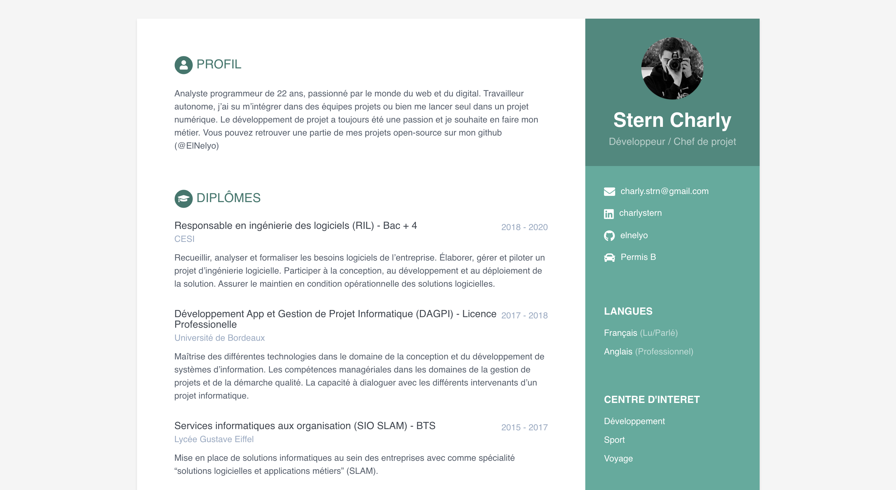
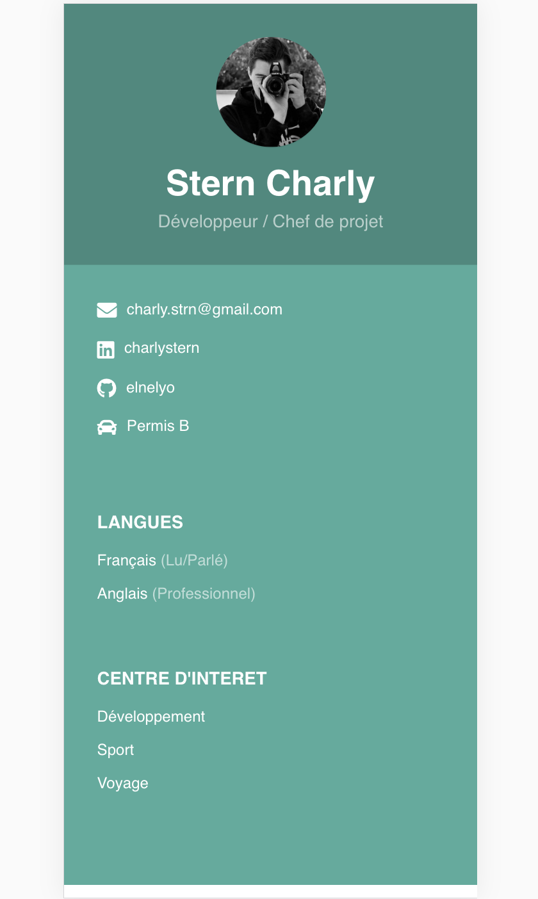

# Curriculum Vitae

Vous pouvez retrouver içi mon curriculum vitae en ligne.

Pour accéder à la version PDF, cliquez sur Ctrl + P 

Ce CV a été créé via [online-cv](https://github.com/sharu725/online-cv).

## Lien 

https://elnelyo.github.io/online-cv/

<table>
  <tr>
    <th>Desktop</th>
    <th>Mobile</th>
  </tr>
  <tr>
    <td>
        
    </td>
    <td>
        
    </td>
  </tr>
</table>

## Credits

Thanks to [Nelson Estevão](https://github.com/nelsonmestevao) for all the [contributions](https://github.com/sharu725/online-cv/commits?author=nelsonmestevao).

Thanks to [t-h-e(sfrost)](https://github.com/t-h-e) for all the [contributions](https://github.com/sharu725/online-cv/commits?author=t-h-e).

Check out for more themes: [**Jekyll Themes**](http://jekyll-themes.com).

## License

This project is licensed under the [MIT license](LICENSE.txt).
